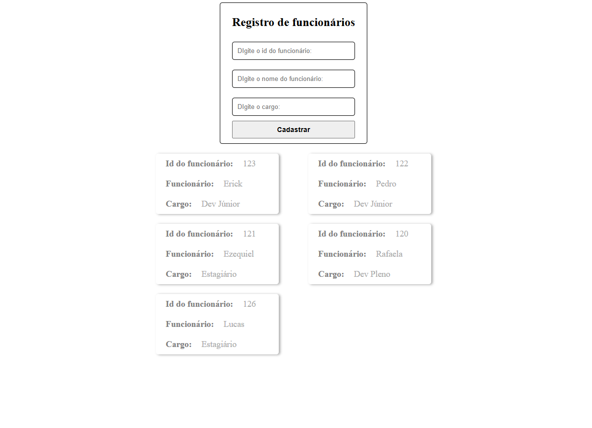

## Formulário Typescript e ReactJs
#### Este projeto teve como intuito a fixação do conteúdo sobre o uso do Typescript com ReactJs.

Este formulário recebe por meio dos inputs, informações sobre um funcionário, ao preencher todos os campos e clicar no botão "cadastrar" ou apertar o enter,
o funcionário será listado junto aos demais funcionáriops que estiverem cadastrados.

Obs: Como o objetivo era apenas fixar conteúdo, não foi utilizado nenhum banco de dados para armazenar esses dados, apenas arrays que armazenam os valores colocados no formulário.

- ### Instalação e uso:
  
  - Clone o repositório:    https://github.com/ErickWillyan/formulario-e-componentes-ReactJS-e-Typescript.git;
  - Acesse a pasta formularios: cd formularios;
  - Execute o comando __npm i__, em seguida __npm run dev__;
    

#### Imagem da aplicação:

